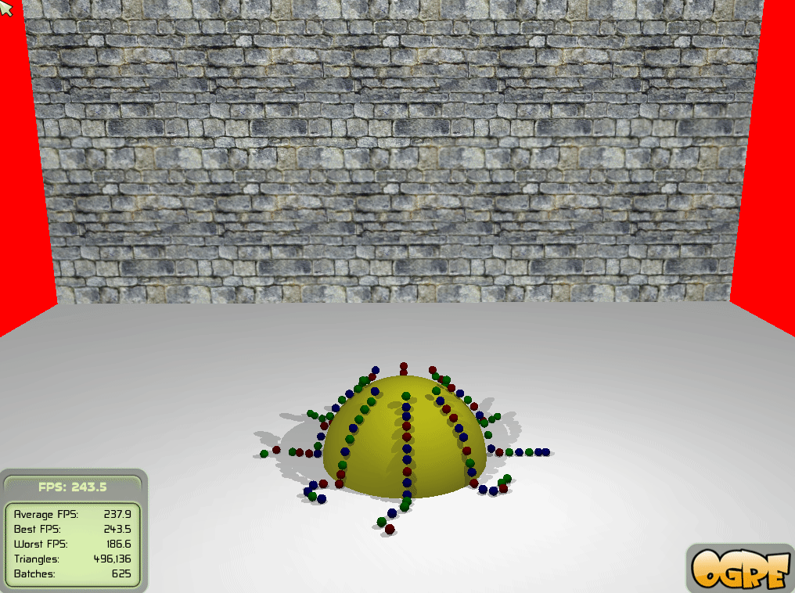

# 3D Game Programming Assignments

Assignments Repo for 3D Game Programming (ILE5043) held by NCTU 

> I did not join the course, that's why not all assignments are included.

## Assignent 1

* Draw Scene & lights with OGRE

## Quiz 3

* Implement stable spring mass system

    (Red for unstable version, Blue for stable version)

